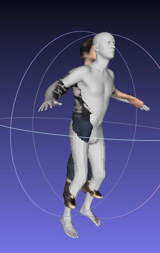
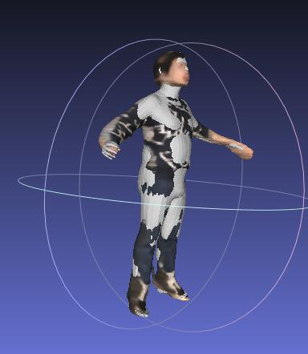
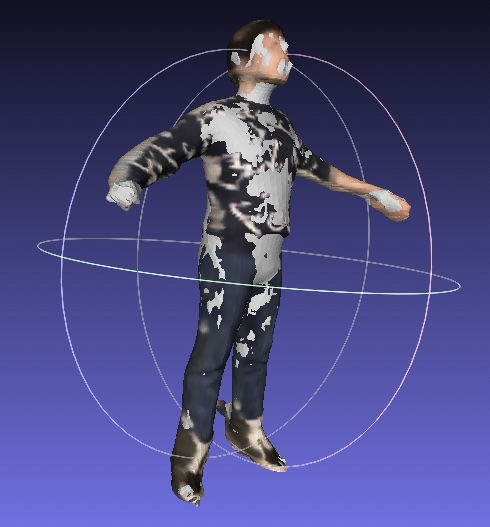

# SMPL Registration

A Pytorch3D-based registration method between a reconstructed point cloud (e.g., the output of PIFuHD) and an estimated SMPL mesh (e.g., ProHMR).





Left: before registration. Middel: after SMPL registration. Right: after SMPL+D registration.

## Install

```
python3 setup.py develop -i http://mirrors.aliyun.com/pypi/simple/
```

## Point cloud and SMPL estimation results

1. Run PIFu code to estimate the point cloud.

1. Run ProHMR/PARE code to generate an initial SMPL estimation.

## Running registration

The registration will optimize SMPL's shape / pose / scale / translation to align the point cloud and SMPL vertices.

SMPL-based registration:

```
python3 scripts/smpl_registration.py --config configs/pifu_prohmr_smpl.yaml
```

SMPL+D-based registration:

```
python3 scripts/smpl_registration.py --config configs/pifu_prohmr_smpld.yaml
```

The results will be saved in the ```outputs/register_smpl.obj``` (for visualization) and ```outputs/register_smpl.pkl``` (with the registered SMPL parameters).


## Animation of the registrated model

With a registered SMPL or SMPL+D model, the avatar can be animated given a motion sequence.

```
python3 scripts/smpl_animation.py
```

The resulting rendered video will be saved in the ```outputs/animation_video.mp4```
