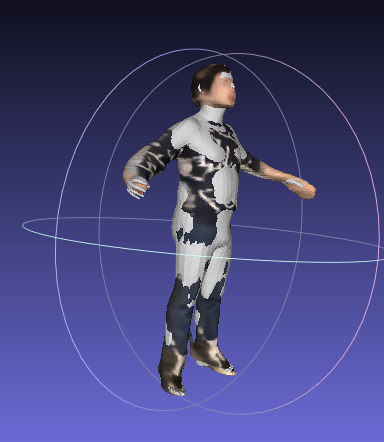

# SMPL Registration

A Pytorch3D-based registration method between a reconstructed point cloud (e.g., the output of PIFuHD) and an estimated SMPL mesh (e.g., ProHMR).




## Install

```
python3 setup.py develop -i http://mirrors.aliyun.com/pypi/simple/
```

## Point cloud and SMPL estimation results

1. Run PIFu code to estimate the point cloud.

1. Run ProHMR/PARE code to generate an initial SMPL estimation.

## Running registration

```
python3 demo.py
```

The registration will optimize SMPL's shape / pose / scale / translation to align the point cloud and SMPL vertices.

The results will be saved in the ```outputs/register_smpl.obj``` (for visualization) and ```outputs/register_smpl.pkl```.
