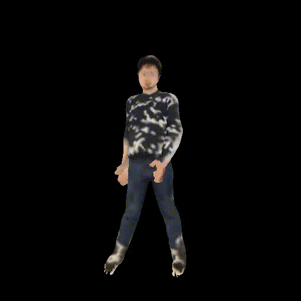

# SMPL Registration

A Pytorch3D-based registration method between a reconstructed point cloud (e.g., the output of PIFuHD, scan data, or synthetic data like CLOTH4D) and an estimated SMPL mesh (e.g., HMR, ProHMR, or PyMAF).


Left: before registration. Middel: after SMPL registration. Right: after SMPL+D registration.

The registered SMPL+D mesh could be further animated given a motion sequence:



## Install

You need to first install a modified version of smplx, which support smpl+d body model:

```
git clone https://github.com/xthan/smplxd.git
cd smplxd
pip install -e .
```

Then install ```smplreg``` package:

```
git clone https://github.com/xthan/smplreg.git
cd smplreg
pip install -e .
```

## Point cloud and SMPL estimation results

1. Run PIFu code to estimate the point cloud.

1. Run ProHMR/PARE code to generate an initial SMPL estimation.

## Running registration

The registration will optimize SMPL's shape / pose / scale / translation to align the point cloud and SMPL vertices.

SMPL-based registration:

```
python3 scripts/smpl_registration.py --config configs/smpl.yaml
```

SMPL+D-based registration:

```
python3 scripts/smpl_registration.py --config configs/smpld.yaml
```

The results will be saved in the ```outputs/register_smpl.obj``` (for visualization) and ```outputs/register_smpl.pkl``` (with the registered SMPL parameters).

## Running on [CLOTH4D](https://github.com/AemikaChow/CLOTH4D)

```
python3 scripts/cloth4d_smpl_registration.py
```

## Animation of the registrated model

With a registered SMPL or SMPL+D model, the avatar can be animated given a motion sequence.

```
python3 scripts/smpl_animation.py
```

The resulting rendered video will be saved in the ```outputs/animation_video.mp4```
